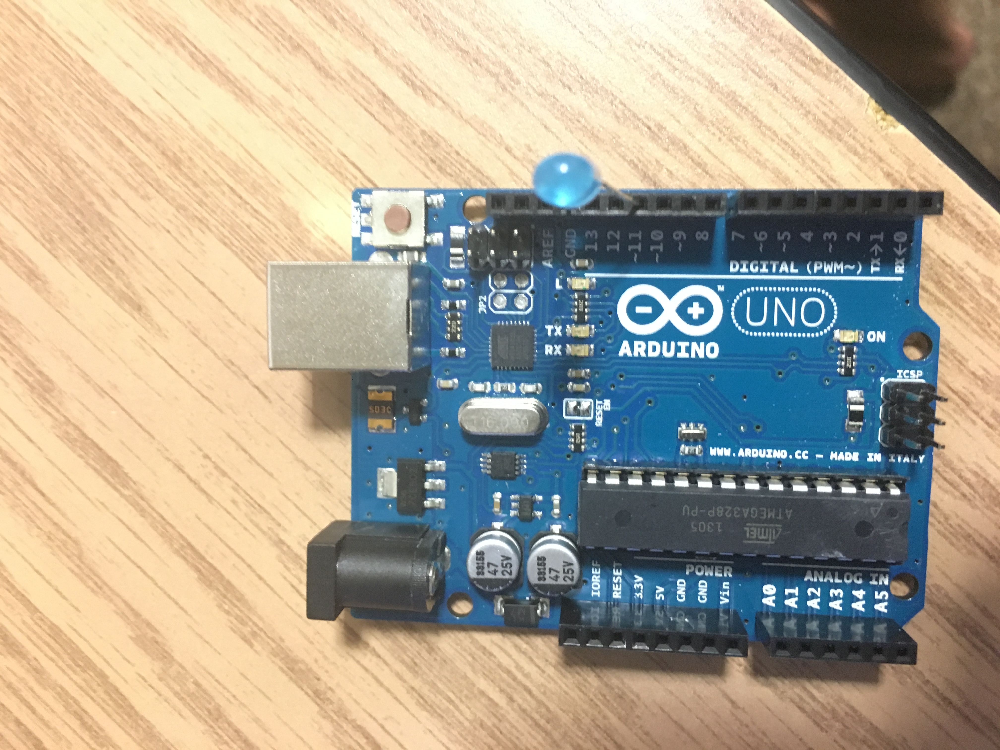

# TAG-DSP Week 1
# Introduction to Arduino (and a little Python on top)

So this week, we started our journey of DSP with a little Arduino. Here's a guide to getting started with what we covered this week.

## Setting up Arduino

### Downloading Arduino

Go to [the Arduno website](https://www.arduino.cc/en/Main/Software) and download their Arduino software for your operating system. You can either do the standalone installer or the portable version, either should work.

### Setting up the Arduino
To set up the Arduino for our demos, put an LED into pin 11. We use this pin because not only is it a digital pin, but it also can simulate an analog one, which makes it useful for Pulse-Width Modulation. 

The Arduino should look like this:

### Problems
* My computer won't upload the program!
In this case, go to Tools -> Serial Port and select the Arduino that's currently plugged into your computer.

## Arduino Demos

### Blink
The Blink demo can be found in Arduino/Blink.ino. It's a fairly simple demo - turn the LEDs on, delay for a second, turn LED off, delay for a second. Play around with it - if you don't have an LED, you can use pin 13. Pin 13 is also connected to an LED on the board, so you can see the LED turn on and off at certain times.

### Pulse-Width Modulation
Pulse-Width Modulation is a modulation scheme that adjusts the time the signal is off to provide a different average value to a signal. For example, if we want to turn the brightness of the LED to half, we would set the on time of the LED to be on for half the time, and off for half the time, and switching between the two values very quickly (often per cycle of the underlying clock).

The point of this is that we can adjust the brightness of the LED, by simply setting another parameter - in this case, the second argument to the analogWrite() function. This value has to be between 0 and 255, where 0 is "off" and 255 is "completely bright". This value will be used to calculate the amount of time the LED has to be sent a voltage of 5 V and the amount of time the voltage has to be 0 V. The average value of that signal will end up being the brightness of the LED which we want!

### Fading Demo

This demo can be found in Arduino/Fading.ino. It adjusts the brightness value by 5 for every loop iteration up to the maximum of 255, and then decrements by 5 until it hits 0 again to fade out. Upload the code and see what happens!

## Python Setup

This is a bit of a complex process, so feel free to contact me if you have any problems.

1. Head over to the [Miniconda website](http://conda.pydata.org/miniconda.html) and download the installer that corresponds to your operating system. You can use either Python 2 or Python 3, but I'll be using Python 3 for now.

2. Install the program.

3. In the search bar (on Windows) search for Anaconda prompt, and enter it. It should give you a command prompt (don't get scared!)

4. Create an environment, by typing in the command

`conda create -n tag-dsp python`

This creates an environment called "tag-dsp" with the default Python installed. An environment is basically an isolated resource that allows us to write code without affecting any other projects we may have. It's fairly useful if you have multiple code projects and you don't want any packages to interfere with each other.

5. Enter the environment by typing

`source activate tag-dsp`

You should now have a (tag-dsp) prepended to the beginning of your command line.

You can leave the environment by typing (while you're in the environment):

`source deactivate`

## Python Demos

The Python demo requires the installation of pyserial. To install this, enter your environment (created above) and type:

`conda install pyserial`

This should install pyserial into your environment for you to use. Now we can simply run the script and control and read data from the Arduino at will.

The Python script can be seen in python/ArduinoRead.py. It is to be used with the Fading_Serial program for the Arduino. 

## Serial Connections

The Arduino is really run through a serial connection. Data is sent through from the Arduino to the computer, one byte at a time (hence the name, serial). When we upload our code to the board, we're uploading the current program one byte at a time. Quite a few devices are serial devices, such as your mouse and keyboard. 

We can open up a serial connection, by using the Serial Monitor on our computer. Go to Tools -> Serial -> Serial Port Monitor. If you're running the Fading_Serial program, you can see that the values of fadeValues are being outputted to the monitor. 

To do this, we first have to initialize a Serial connection by putting up Serial.begin(baudrate) in the setup() function. This initializes a connection with a baudrate (or speed) of 9600. You can go up to 115200 if I remember correcty. Then we put in a Serial.println() for whatever we want to send. 

Now, close the Serial Port Monitor. Open up your Anaconda Prompt, and navigate to your script (use the cd command to change the directory to wherever your program is located). You can run the program by typing 

`python ArduinoRead.py` 

in the command prompt. Voila, you should see the values of fadeValue being printed!

## Conclusion
This week, we covered a basic intro to Arduino, learned about PWM, and programmed a little in Python. Next week, we hopefully get our LED strips and start working with the library that comes with it. Or just solder a bunch of LED strips together. We'll see. 

## Contact
Email me at saad4@illinois.edu if you have any questions.

## Links

[1] Arduino (https://www.arduino.cc/en/Main/Software)
[2] PySerial (https://pythonhosted.org/pyserial/)
[3] Arduino with Python (http://playground.arduino.cc/Interfacing/Python)
[4] PWM in Arduino (https://www.arduino.cc/en/Tutorial/PWM)